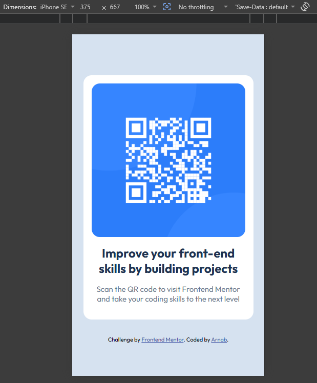
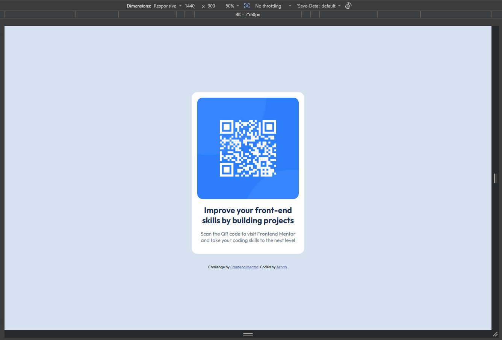

# Frontend Mentor - QR code component solution

This is a solution to the [QR code component challenge on Frontend Mentor](https://www.frontendmentor.io/challenges/qr-code-component-iux_sIO_H).

## Table of Contents

- [Overview](#overview)
- [Screenshot](#screenshot)
- [Links](#links)
- [My Process](#my-process)
  - [Built With](#built-with)
  - [What I Learned](#what-i-learned)
- [Author](#author)

## Overview

The challenge is to build a simple QR code card component that matches the given design as closely as possible.

### Screenshot

 

### Links

- Solution URL: [Github](https://github.com/vo1d-bot/QR-code-Component.git)
- Live Site: [Vercel](https://qr-code-component-five-black.vercel.app/)

## My Process

### Built With

- Semantic HTML5 markup
- CSS custom properties (variables)
- Flexbox
- Mobile-first workflow
- Google Fonts (Outfit)

### What I Learned

This was a great starter project to practice:
- Proper vertical and horizontal centering with Flexbox
- Using CSS custom properties for better maintainability
- Responsive design using `max-width` + `width: 100%`
- Writing clean, semantic HTML and well-organized CSS

I improved my understanding of:
- The difference between `width` and `max-width`
- Image optimization and proper `alt` text

## Author

- GitHub - [vo1d-bot](https://github.com/vo1d-bot)
- Frontend Mentor - [https://www.frontendmentor.io/profile/vo1d-bot](https://www.frontendmentor.io/profile/yourusername)

---

**Feedback & Suggestions Welcome!**  
Feel free to leave any feedback or suggestions to help me improve.
